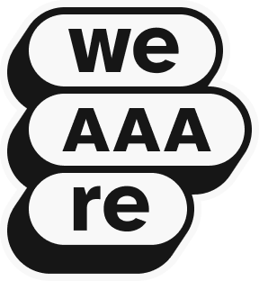

<p align="center">
  
</p>

<h1 align="center">a11y-agents-kit</h1>

<p align="center">
  Accessibility tools and agent skills for AI coding agents — by <a href="https://weAAAre.com">weAAAre</a>, the digital accessibility school.
</p>

<p align="center">
  <a href="https://github.com/weAAAre/a11y-agents-kit/actions/workflows/ci.yml"></a>
  <a href="./LICENSE"></a>
  <a href="https://nodejs.org/">= 24" /></a>
  <a href="https://pnpm.io/"></a>
</p>

---

## What is weAAAre?

[weAAAre](https://weAAAre.com) is an online school dedicated to digital accessibility. It offers asynchronous courses at your own pace covering UX/UI design, web development, product management, QA, and more — all focused on building inclusive digital products.

This monorepo is weAAAre's open-source contribution: free MCP servers and agent skills that bring accessibility checks directly into AI-assisted development workflows.

## What's inside

This monorepo contains two types of distributable content:

### MCP Servers (`packages/`)

[Model Context Protocol](https://modelcontextprotocol.io/) servers that give AI coding agents programmatic accessibility tooling.

| Package | WCAG 2.2 coverage | Install |
|---------|-------------------|---------|
| [`@weaaare/mcp-a11y-color`](./packages/mcp-a11y-color/) | Up to 5 success criteria (1.4.1, 1.4.3, 1.4.6, 1.4.11, 2.4.7) | `npx @weaaare/mcp-a11y-color` |
| [`@weaaare/mcp-voiceover-auditor`](./packages/mcp-voiceover-auditor/) | Up to 12 success criteria (1.1.1, 1.3.1, 2.1.1, 2.1.2, 2.4.1–2.4.6, 3.3.1, 3.3.2, 4.1.2) | `npx @weaaare/mcp-voiceover-auditor` |
| [`@weaaare/mcp-virtual-screen-reader-auditor`](./packages/mcp-virtual-screen-reader-auditor/) | Up to 12 success criteria (same scope as VoiceOver auditor) | `npx @weaaare/mcp-virtual-screen-reader-auditor` |

#### `@weaaare/mcp-a11y-color`

Real-time color accessibility verification for AI agents. Check WCAG 2.2 contrast ratios, simulate 8 types of color-vision deficiency, audit full design-token palettes, and get automatic fix suggestions — all while writing code.

#### `@weaaare/mcp-voiceover-auditor`

Drives macOS VoiceOver through AppleScript, letting an AI agent navigate pages exactly as a screen-reader user would: read element announcements, check focus order, detect keyboard traps, and log structured WCAG findings — all without a human manually operating VoiceOver.

#### `@weaaare/mcp-virtual-screen-reader-auditor`

Launches a headless browser with a virtual screen reader injected into the page. Same navigation and audit capabilities as the VoiceOver auditor but runs on **any OS** — no native screen reader install required.

> **Why screen-reader MCPs?**
>
> Screen-reader testing is one of the most valuable — and most skipped — steps in accessibility work. The friction is real: learning VoiceOver or NVDA takes time, setting up automated screen-reader tests is complex, and most development teams simply don't do it.
>
> These MCPs break that barrier. They let an AI agent operate a screen reader programmatically, navigate pages, read announcements, and log findings — turning what used to require specialist expertise into something any developer can trigger from their editor.
>
> The potential is significant: automated screen-reader checks on every PR, instant feedback during development, structured WCAG reports without leaving your IDE.
>
> **Important:** these tools do **not** replace a manual audit by an accessibility specialist, nor do they substitute real testing with assistive-technology users. They are a fast feedback loop that catches common issues early — a complement, never a replacement.

### Agent Skills (`skills/`)

Reusable procedural knowledge for AI coding agents, distributed via [skills.sh](https://skills.sh).

| Skill | Description | Install |
|-------|-------------|---------|
| [`aria-patterns`](./skills/aria-patterns/) | Accessible ARIA patterns for interactive UI components | `npx skills add weAAAre/a11y-agents-kit@aria-patterns` |

---

## Getting started

### MCP Servers

Install any of the MCP servers in your preferred client. Pick the servers you need — you can use one, two, or all three.

**Standard config** works in most MCP clients:

```json
{
  "mcpServers": {
    "a11y-color": {
      "command": "npx",
      "args": ["-y", "@weaaare/mcp-a11y-color"]
    },
    "voiceover-auditor": {
      "command": "npx",
      "args": ["-y", "@weaaare/mcp-voiceover-auditor"]
    },
    "virtual-screen-reader-auditor": {
      "command": "npx",
      "args": ["-y", "@weaaare/mcp-virtual-screen-reader-auditor"]
    }
  }
}
```

> **Note:** `mcp-voiceover-auditor` requires macOS with VoiceOver and AppleScript enabled. `mcp-virtual-screen-reader-auditor` works on any OS.

<details>
<summary>VS Code</summary>

Add to your project's `.vscode/mcp.json` (or user-level `settings.json` under `"mcp"`):

```json
{
  "servers": {
    "a11y-color": {
      "command": "npx",
      "args": ["-y", "@weaaare/mcp-a11y-color"]
    },
    "voiceover-auditor": {
      "command": "npx",
      "args": ["-y", "@weaaare/mcp-voiceover-auditor"]
    },
    "virtual-screen-reader-auditor": {
      "command": "npx",
      "args": ["-y", "@weaaare/mcp-virtual-screen-reader-auditor"]
    }
  }
}
```

Or install via the VS Code CLI:

```bash
# Color contrast tools
code --add-mcp '{"name":"a11y-color","command":"npx","args":["-y","@weaaare/mcp-a11y-color"]}'

# VoiceOver auditor (macOS only)
code --add-mcp '{"name":"voiceover-auditor","command":"npx","args":["-y","@weaaare/mcp-voiceover-auditor"]}'

# Virtual screen reader auditor (any OS)
code --add-mcp '{"name":"virtual-screen-reader-auditor","command":"npx","args":["-y","@weaaare/mcp-virtual-screen-reader-auditor"]}'
```

After installation, the servers will be available for use with GitHub Copilot in VS Code.

</details>

<details>
<summary>Claude Desktop</summary>

Follow the MCP install [guide](https://modelcontextprotocol.io/quickstart/user). Add to your `claude_desktop_config.json`:

```json
{
  "mcpServers": {
    "a11y-color": {
      "command": "npx",
      "args": ["-y", "@weaaare/mcp-a11y-color"]
    },
    "voiceover-auditor": {
      "command": "npx",
      "args": ["-y", "@weaaare/mcp-voiceover-auditor"]
    },
    "virtual-screen-reader-auditor": {
      "command": "npx",
      "args": ["-y", "@weaaare/mcp-virtual-screen-reader-auditor"]
    }
  }
}
```

</details>

<details>
<summary>Claude Code</summary>

Use the Claude Code CLI:

```bash
claude mcp add a11y-color npx -y @weaaare/mcp-a11y-color
claude mcp add voiceover-auditor npx -y @weaaare/mcp-voiceover-auditor
claude mcp add virtual-screen-reader-auditor npx -y @weaaare/mcp-virtual-screen-reader-auditor
```

</details>

<details>
<summary>Cursor</summary>

Go to `Cursor Settings` → `MCP` → `Add new MCP Server`. Use `command` type with one of:

```
npx -y @weaaare/mcp-a11y-color
npx -y @weaaare/mcp-voiceover-auditor
npx -y @weaaare/mcp-virtual-screen-reader-auditor
```

Or add them to your `.cursor/mcp.json`:

```json
{
  "mcpServers": {
    "a11y-color": {
      "command": "npx",
      "args": ["-y", "@weaaare/mcp-a11y-color"]
    },
    "voiceover-auditor": {
      "command": "npx",
      "args": ["-y", "@weaaare/mcp-voiceover-auditor"]
    },
    "virtual-screen-reader-auditor": {
      "command": "npx",
      "args": ["-y", "@weaaare/mcp-virtual-screen-reader-auditor"]
    }
  }
}
```

</details>

<details>
<summary>Windsurf</summary>

Follow Windsurf MCP [documentation](https://docs.windsurf.com/windsurf/cascade/mcp). Use the standard config above.

</details>

<details>
<summary>Cline</summary>

Add the following to your [`cline_mcp_settings.json`](https://docs.cline.bot/mcp/configuring-mcp-servers#editing-mcp-settings-files):

```json
{
  "mcpServers": {
    "a11y-color": {
      "type": "stdio",
      "command": "npx",
      "args": ["-y", "@weaaare/mcp-a11y-color"],
      "disabled": false
    },
    "voiceover-auditor": {
      "type": "stdio",
      "command": "npx",
      "args": ["-y", "@weaaare/mcp-voiceover-auditor"],
      "disabled": false
    },
    "virtual-screen-reader-auditor": {
      "type": "stdio",
      "command": "npx",
      "args": ["-y", "@weaaare/mcp-virtual-screen-reader-auditor"],
      "disabled": false
    }
  }
}
```

</details>

<details>
<summary>Kiro</summary>

Follow the MCP Servers [documentation](https://kiro.dev/docs/mcp/). Add to `.kiro/settings/mcp.json` using the standard config above.

</details>

<details>
<summary>Codex</summary>

Use the Codex CLI:

```bash
codex mcp add a11y-color npx "-y" "@weaaare/mcp-a11y-color"
codex mcp add voiceover-auditor npx "-y" "@weaaare/mcp-voiceover-auditor"
codex mcp add virtual-screen-reader-auditor npx "-y" "@weaaare/mcp-virtual-screen-reader-auditor"
```

Or edit `~/.codex/config.toml`:

```toml
[mcp_servers.a11y-color]
command = "npx"
args = ["-y", "@weaaare/mcp-a11y-color"]

[mcp_servers.voiceover-auditor]
command = "npx"
args = ["-y", "@weaaare/mcp-voiceover-auditor"]

[mcp_servers.virtual-screen-reader-auditor]
command = "npx"
args = ["-y", "@weaaare/mcp-virtual-screen-reader-auditor"]
```

</details>

<details>
<summary>Goose</summary>

Go to `Advanced settings` → `Extensions` → `Add custom extension`. Use type `STDIO` and set the command to one of:

- `npx -y @weaaare/mcp-a11y-color`
- `npx -y @weaaare/mcp-voiceover-auditor`
- `npx -y @weaaare/mcp-virtual-screen-reader-auditor`

</details>

<details>
<summary>Warp</summary>

Go to `Settings` → `AI` → `Manage MCP Servers` → `+ Add`. Use the standard config above.

Alternatively, use `/add-mcp` in the Warp prompt and paste the standard config.

</details>

<details>
<summary>Gemini CLI</summary>

Follow the MCP install [guide](https://github.com/google-gemini/gemini-cli/blob/main/docs/tools/mcp-server.md#configure-the-mcp-server-in-settingsjson). Use the standard config above.

</details>

### Agent Skills

```bash
# Install all skills
npx skills add weAAAre/a11y-agents-kit

# Install a specific skill
npx skills add weAAAre/a11y-agents-kit@aria-patterns
```

---

## MCP tools — `@weaaare/mcp-a11y-color`

| Tool | Description |
|------|-------------|
| `check-contrast` | WCAG 2.2 contrast ratio between fg/bg — pass/fail for AA/AAA, normal/large/UI |
| `get-color-info` | Parse any CSS color → hex, RGB, HSL, luminance, contrast on B/W |
| `suggest-contrast-fix` | Suggest the minimal color change to meet a target WCAG level |
| `simulate-color-blindness` | Simulate colors under 8 types of color vision deficiency |
| `find-accessible-color` | Given background + hue, find a color meeting a target contrast ratio |
| `apca-contrast` | APCA Lc (WCAG 3.0 draft) perceptual contrast score |
| `nearest-color-name` | Find the closest CSS named color(s) using perceptual Delta E |
| `analyze-palette-contrast` | N×N contrast matrix for a set of colors — design system audits |
| `generate-cvd-safe-palette` | Generate a palette distinguishable under all CVD types |
| `analyze-design-tokens` | Audit design tokens for WCAG compliance with automatic fixes |

## MCP tools - `@weaaare/mcp-voiceover-auditor`

| Tool | Description |
|------|-------------|
| `check_setup` | Verify VoiceOver environment setup (AppleScript, OS support, screen reader readiness) |
| `voiceover_start` | Start VoiceOver before running navigation and audit commands |
| `voiceover_stop` | Stop VoiceOver and clean up the session |
| `voiceover_commander` | Execute native VoiceOver commander commands for reliable navigation |
| `voiceover_perform` | Execute keyboard-driven VoiceOver navigation commands |
| `voiceover_next` | Move the VoiceOver cursor to the next item |
| `voiceover_previous` | Move the VoiceOver cursor to the previous item |
| `voiceover_act` | Perform default action for focused item (VO-Space equivalent) |
| `voiceover_interact` | Start interacting with the current container item |
| `voiceover_stop_interacting` | Stop interacting with the current container item |
| `voiceover_press` | Press a key on the focused item (e.g. `Enter`, `Tab`, `ArrowDown`) |
| `voiceover_type` | Type text into the currently focused item |
| `voiceover_item_text` | Read current focused item text announced by VoiceOver |
| `voiceover_last_spoken_phrase` | Get the latest spoken output from VoiceOver |
| `voiceover_spoken_phrase_log` | Get full spoken phrase history for this session |
| `voiceover_item_text_log` | Get full visited item text history for this session |
| `voiceover_clear_spoken_phrase_log` | Clear the spoken phrase log for this session |
| `voiceover_clear_item_text_log` | Clear the item text log for this session |
| `voiceover_click` | Perform a mouse click at the current position |
| `voiceover_detect` | Detect whether VoiceOver is supported on the current system |
| `voiceover_default` | Check whether VoiceOver is the default screen reader |
| `macos_activate_application` | Activate a macOS application by name |
| `macos_get_active_application` | Get the currently active macOS application |
| `focus_history` | Retrieve complete focus breadcrumb history |
| `focus_ensure_browser` | Ensure browser is focused before audit navigation |
| `focus_record` | Record focus breadcrumbs for recovery during audits |
| `focus_last_known` | Recover last known focus position if context is lost |
| `start_audit` | Start a structured audit session with metadata |
| `log_finding` | Log violations/warnings/passes with WCAG criteria and recommendations |
| `get_audit_status` | Get current audit progress and finding counters |
| `get_findings` | Retrieve findings from current or latest session |
| `end_audit` | End audit session and return summary data |
| `generate_report` | Generate reports in Markdown, JSON, or CSV |

## MCP tools — `@weaaare/mcp-virtual-screen-reader-auditor`

| Tool | Description |
|------|-------------|
| `virtual_start` | Start the Virtual Screen Reader on a URL or raw HTML (launches headless browser) |
| `virtual_stop` | Stop the Virtual Screen Reader and release resources |
| `virtual_next` | Move cursor to the next item in the accessibility tree |
| `virtual_previous` | Move cursor to the previous item in the accessibility tree |
| `virtual_act` | Perform default action for the current item (e.g., activate a link/button) |
| `virtual_interact` | Interact with the current container item |
| `virtual_stop_interacting` | Stop interacting with the current container item |
| `virtual_press` | Press a key on the focused item (e.g. `Enter`, `Tab`, `ArrowDown`) |
| `virtual_type` | Type text into the currently focused item |
| `virtual_perform` | Semantic navigation by element type: headings, links, landmarks, forms, figures |
| `virtual_item_text` | Get text of the item under the Virtual Screen Reader cursor |
| `virtual_last_spoken_phrase` | Get the last phrase spoken by the Virtual Screen Reader |
| `virtual_spoken_phrase_log` | Get full spoken phrase history for this session |
| `virtual_item_text_log` | Get full visited item text history for this session |
| `virtual_clear_spoken_phrase_log` | Clear the spoken phrase log |
| `virtual_clear_item_text_log` | Clear the visited item text log |
| `virtual_click` | Click the mouse at the current position |
| `start_audit` | Start a structured audit session with metadata |
| `log_finding` | Log violations/warnings/passes with WCAG criteria and recommendations |
| `get_audit_status` | Get current audit progress and finding counters |
| `get_findings` | Retrieve findings from current or latest session |
| `end_audit` | End audit session and return summary data |
| `generate_report` | Generate reports in Markdown, JSON, or CSV |

---

## Local development

### Prerequisites

- [Node.js](https://nodejs.org/) >= 24
- [pnpm](https://pnpm.io/) >= 9

### Setup

```bash
git clone https://github.com/weAAAre/a11y-agents-kit.git
cd a11y-agents-kit
pnpm install
pnpm build
```

### Common commands

| Command | Description |
|---------|-------------|
| `pnpm build` | Build all packages |
| `pnpm dev` | Watch mode |
| `pnpm check` | Lint + format with Biome (auto-fix) |
| `pnpm ci:check` | Lint + format for CI (no auto-fix) |
| `pnpm check-types` | TypeScript type checking |
| `pnpm test` | Run all tests |
| `pnpm changeset` | Create a changeset for your changes |

---

## Contributing

See [CONTRIBUTING.md](./.github/CONTRIBUTING.md) for the full guide. In short:

1. Fork → branch → implement → `pnpm changeset` → PR
2. Run `pnpm check && pnpm check-types && pnpm test` before pushing
3. Open a PR against `main` with a [conventional commit](https://www.conventionalcommits.org/) title

---

## Acknowledgements

This project builds on the work and specifications of:

- **[W3C Web Accessibility Initiative (WAI)](https://www.w3.org/WAI/)** — for the [WCAG 2.2](https://www.w3.org/TR/WCAG22/) guidelines, [WAI-ARIA](https://www.w3.org/TR/wai-aria/) specification, and the [ARIA Authoring Practices Guide](https://www.w3.org/WAI/ARIA/apg/). W3C content is used under the [W3C Software and Document License](https://www.w3.org/copyright/software-license/).
- **[a11ysupport.io](https://a11ysupport.io/)** — a community-driven project by Michael Fairchild that documents assistive-technology support for ARIA and HTML features. Data is available under the [Creative Commons Attribution 4.0 International License (CC BY 4.0)](https://creativecommons.org/licenses/by/4.0/).

---

## License

[MIT](./LICENSE) © [weAAAre](https://weAAAre.com)